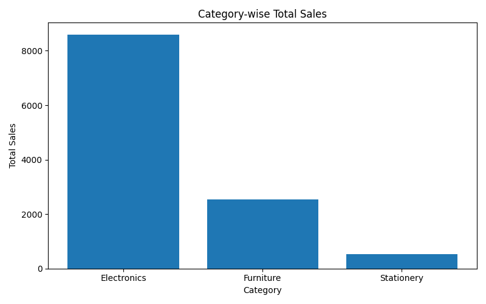
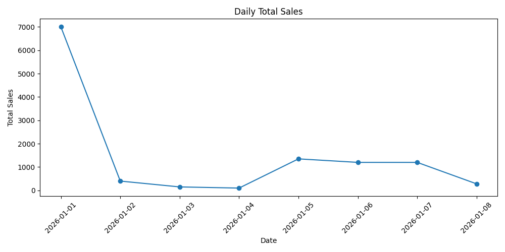
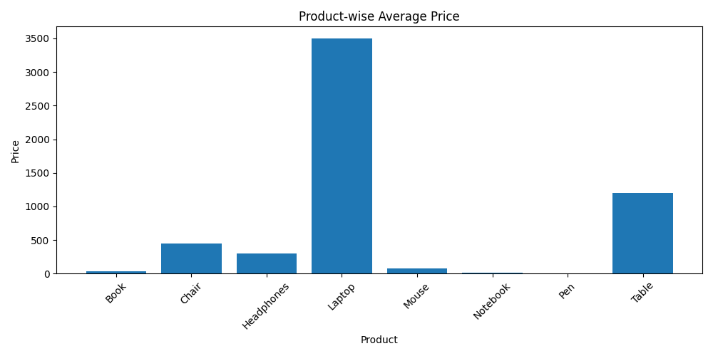
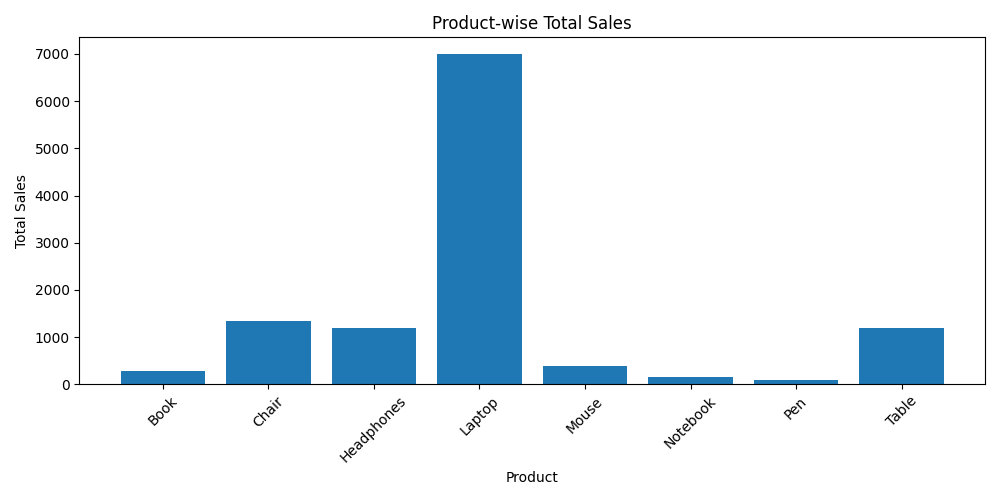

# Sales Data Analyzer

## Project Description

The **Sales Data Analyzer** is a Python project built to analyze sales transaction data, generate useful business insights, and visualize trends through charts.

This project reads sales data from CSV files, performs analysis using **Pandas**, and creates visual reports using **Matplotlib**.

It helps answer business questions such as:

* Which product generated the highest sales?
* Which category performs best?
* What are the daily sales trends?
* What is the average price of each product?

This project demonstrates practical **data analysis and visualization skills**, which are essential for Data Analyst roles.

---

## Tools & Technologies Used

* **Python**
* **Pandas**
* **Matplotlib**
* **Git**
* **GitHub**

---

## Project Features

### Sales Analysis

* Total sales by product
* Total sales by category
* Average product price analysis
* Daily sales trend analysis

### Data Visualization

* Bar charts for product and category sales
* Line chart for daily sales trends
* Average product price comparison chart

---

## Project Structure


sales_data_analyzer/
├── analysis.py
├── sales_data.csv
├── README.md
├── .gitignore
└── output/


## Visual Outputs

### Category Sales Analysis

This chart shows the total sales contribution of each category.




### Daily Sales Trend

This line chart shows how sales changed over time.



---

### Product Price Comparison

This chart compares average prices of products.



---

### Product Sales Performance

This chart shows which products generated the highest revenue.



---

## Key Skills Demonstrated

This project demonstrates:

* Data Cleaning
* Exploratory Data Analysis (EDA)
* Data Aggregation
* Business Insight Generation
* Data Visualization
* Project Structuring
* Version Control using Git & GitHub

---

## Business Value

This project helps businesses:

* Identify high-performing products
* Understand category performance
* Monitor sales trends
* Make better pricing decisions

These insights can support better business decisions and improve profitability.

---

## How to Run the Project

### Clone the repository

```bash id="9k8eg7"
git clone https://github.com/mothethomas/sales_data_analyzer.git
```

### Navigate to the project folder

```bash id="pmdzz1"
cd sales_data_analyzer
```


## Author

**Mothe Thomas**

Aspiring Data Analyst skilled in:

* Python
* SQL
* Power BI
* Machine Learning

GitHub: https://github.com/mothethomas
